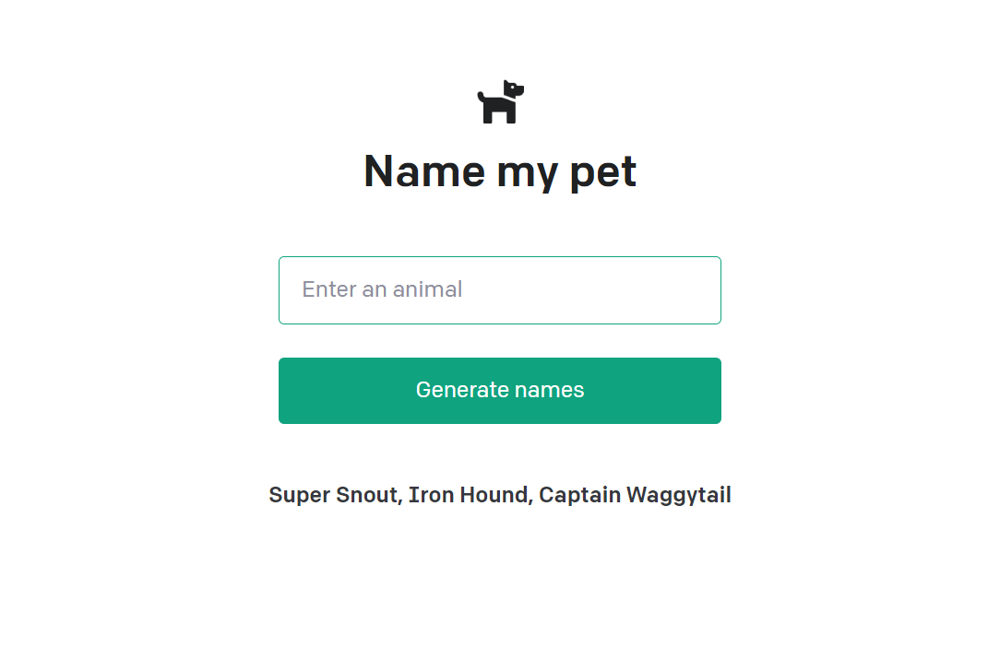
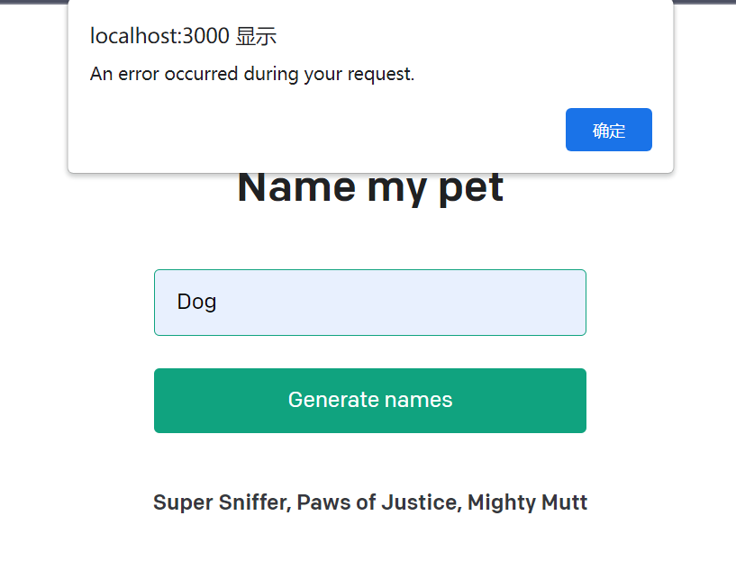
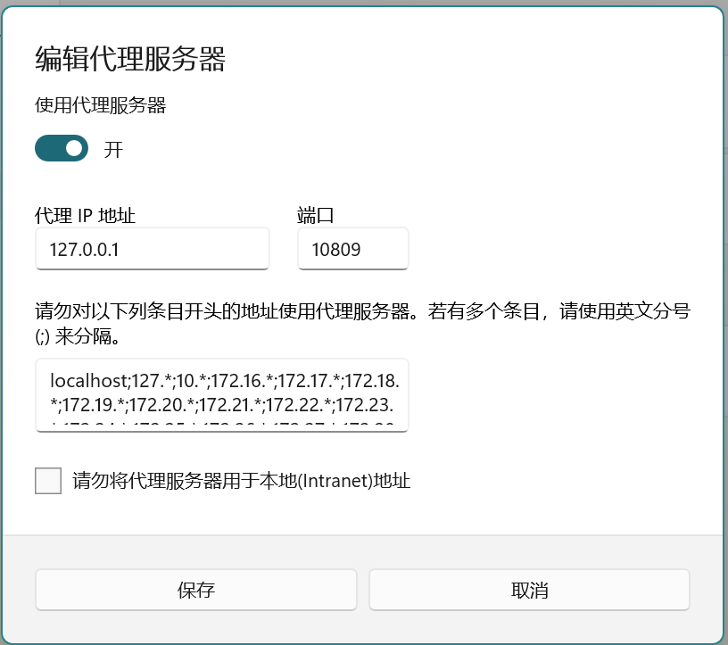
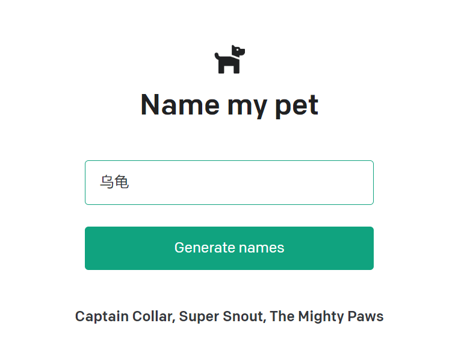

# 体验chatgpt官网教程node版本demo
[官网教程链接](https://platform.openai.com/docs/quickstart/setup)

### 官网教程node demo
```
git clone https://github.com/openai/openai-quickstart-node.git
```

### 运行demo
```
npm install
npm run dev
```

### 正常启动后的界面↓


此demo是让用户在输入框输入动物名，比如dog，它会动态显示出指定动物的提示部分。

但是这里按下Generate names后会出现 An error occurred during your request.



因为node服务是不走代理的，所以你懂的，需要简单配置一下↓
::: tip 我的是win11

    1 进入网络和Internet
    2 进入代理
    3 查看自己的代理端口（至于怎么查，大部分的软件都会显示的）
    4 代理ip输入127.0.0.1，端口写你查到的
:::


然后再次访问还是有问题，报400 The plain HTTP request was sent to HTTPS port，说明需要https访问，这里需要在下一个包 [tunnel](https://github.com/koichik/node-tunnel/#node-tunnel---httphttps-agents-for-tunneling-proxies)

```
npm install tunnel
```

在 `api/generate.js` 下引入， 在createCompletion第二个参数加入httpsAgent: agent，下面是generate.js全部代码
``` ts
import { Configuration, OpenAIApi } from 'openai'
import tunnel from 'tunnel'

const agent = tunnel.httpsOverHttp({ proxy: { host: '127.0.0.1', port: 10809 } })
const configuration = new Configuration({
  apiKey: process.env.OPENAI_API_KEY,
})
const openai = new OpenAIApi(configuration)

export default async function (req, res) {
  if (!configuration.apiKey) {
    res.status(500).json({
      error: {
        message: 'OpenAI API key not configured, please follow instructions in README.md',
      }
    })
    return
  }

  const animal = req.body.animal || ''
  if (animal.trim().length === 0) {
    res.status(400).json({
      error: {
        message: 'Please enter a valid animal',
      }
    })
    return
  }

  try {
    const completion = await openai.createCompletion({
      model: 'text-davinci-003',
      prompt: generatePrompt(animal),
      temperature: 0.6,
    }, {
      httpsAgent: agent
    })
    res.status(200).json({ result: completion.data.choices[0].text })
  }
  catch (error) {
    // Consider adjusting the error handling logic for your use case
    if (error.response) {
      console.error(error.response.status, error.response.data)
      res.status(error.response.status).json(error.response.data)
    }
    else {
      console.error(`Error with OpenAI API request: ${error.message}`)
      res.status(500).json({
        error: {
          message: 'An error occurred during your request.',
        }
      })
    }
  }
}

function generatePrompt(animal) {
  const capitalizedAnimal
    = animal[0].toUpperCase() + animal.slice(1).toLowerCase()
  return `Suggest three names for an animal that is a superhero.

Animal: Cat
Names: Captain Sharpclaw, Agent Fluffball, The Incredible Feline
Animal: Dog
Names: Ruff the Protector, Wonder Canine, Sir Barks-a-Lot
Animal: ${capitalizedAnimal}
Names:`
}
```

再次访问↓


搞定😊，愉快的学习chatgpt吧